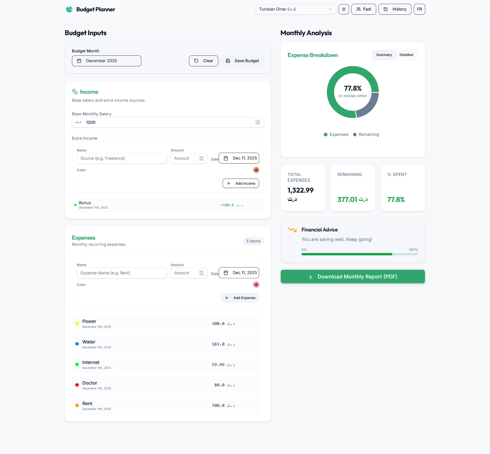
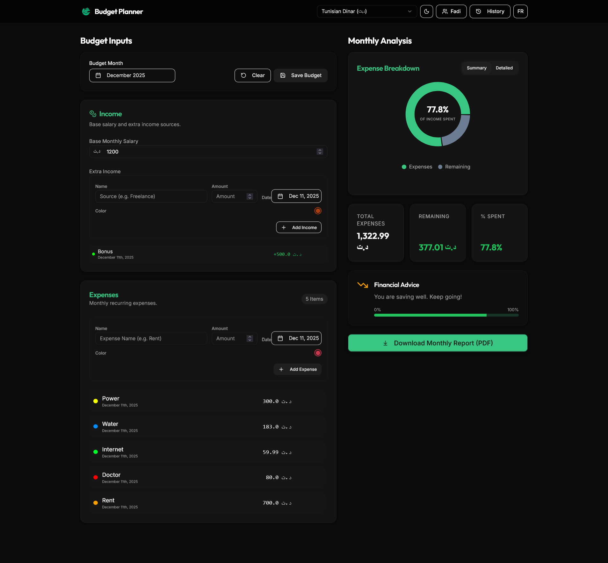
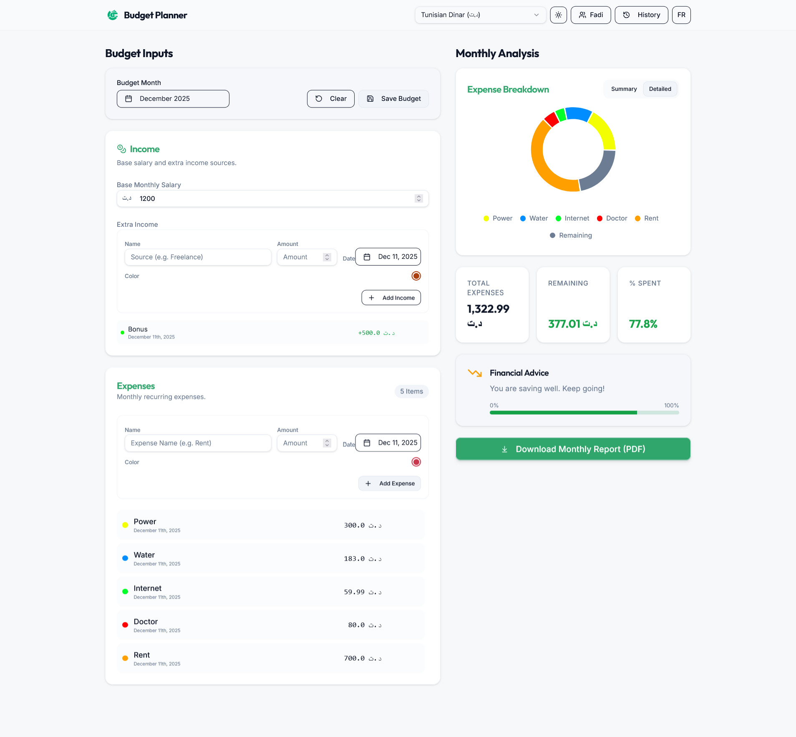
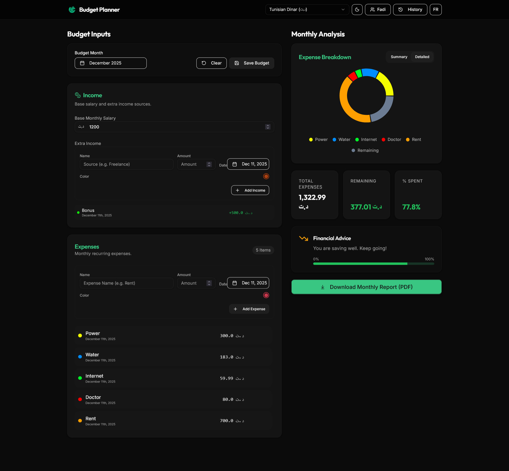
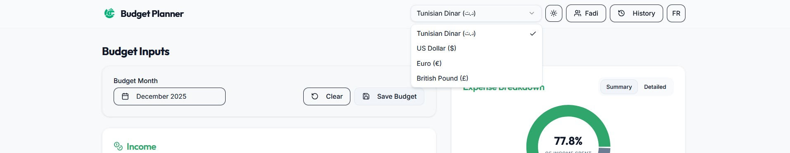
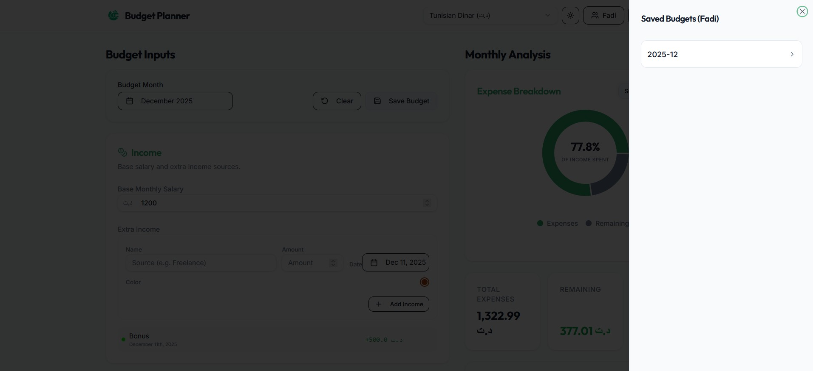
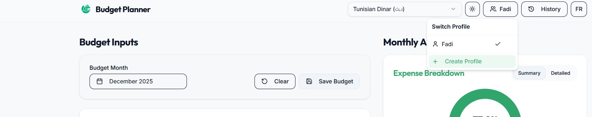

# Budget Planner

> [!WARNING]
> **This is still very much a work in progress!** Expect bugs, incomplete features, and things breaking randomly. I'm actively working on it, so please be patient. If you find issues, feel free to report them.

A simple budget tracker I made to help manage my monthly expenses. Nothing fancy, just tracks income and expenses with some charts to see where the money goes.

````carousel

<!-- slide -->

````

## What it does

- Track your monthly income and expenses
- Add expenses with custom categories and colors
- See pie charts of your spending
- Save budget history for different months
- Multiple profiles (personal, business, etc.)
- Light/dark mode
- Switch currencies (TND, USD, EUR, etc.)
- Export to PDF
- Works on mobile and desktop

````carousel

<!-- slide -->

````







## Running it yourself

You can run this on your own machine, a virtual machine, or even a local home server. Everything runs locally - no cloud services needed.

**Requirements:**
See [DEPLOY.md](DEPLOY.md) for detailed instructions on:
- **Docker** (Recommended)
- **Linux** (Debian/Ubuntu Systemd service)
- **Local Development**

Then go to `http://localhost:5000` in your browser.

## Privacy

All your data stays on your device. Nothing gets sent to any servers or third parties. It's just stored locally in your browser.

## Tech stack

- React + TypeScript
- Tailwind CSS
- Express
- Recharts for the graphs
- Local storage (browser)

## Current status

Again, **this is still a work in progress**. I'm adding features and fixing bugs as I go. Some things might not work perfectly yet, and the code could definitely be cleaner. But it works well enough for my personal use, so I figured I'd share it.

## License

MIT - do whatever you want with it

---

*Made because I needed a simple way to track my budget without using some bloated app or giving my financial data to random companies*